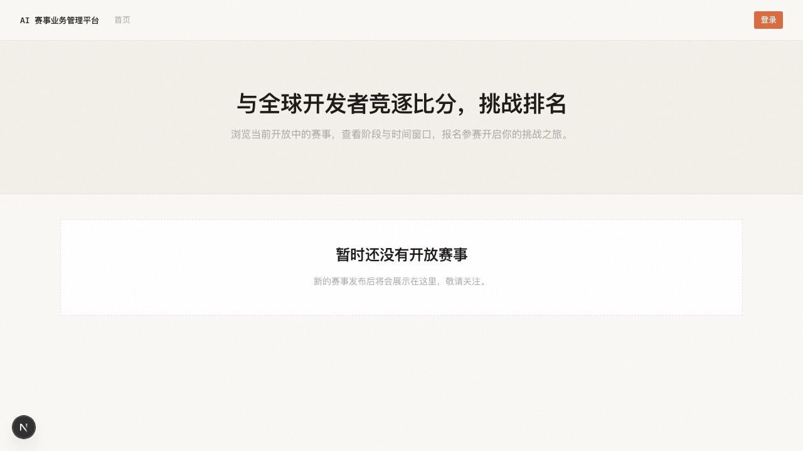
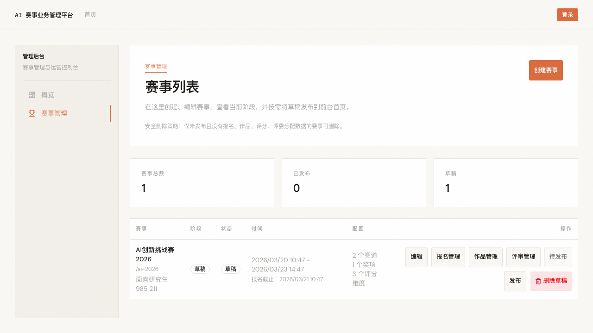

# AI 赛事业务管理平台

AI 赛事管理平台 MVP，支撑核心赛事流程：赛事配置 → 报名 → 作品提交 → 评委评分 → 排名公示。

## 系统截图

### 首页



### 管理后台 — 赛事列表



## 技术栈

- **框架：** Next.js 16 (App Router)
- **语言：** TypeScript
- **数据库：** Prisma ORM
- **认证：** Auth.js (Google OAuth)
- **UI：** Tailwind CSS v4 + shadcn/ui
- **测试：** Vitest
- **运行时：** Bun

## 快速开始

```bash
# 安装依赖
bun install

# 配置环境变量
cp .env.sample .env.local
# 编辑 .env.local 填写 DATABASE_URL、AUTH_SECRET 等

# 数据库迁移
bun run db:migrate

# 启动开发环境
bun run dev
```

打开 [http://localhost:3000](http://localhost:3000) 查看。

## 常用命令

| 命令 | 说明 |
|------|------|
| `bun run dev` | 启动开发服务器 |
| `bun run lint` | 运行 ESLint |
| `bun run typecheck` | 类型检查 |
| `bun run test` | 运行测试 |
| `bun run db:migrate` | 创建并应用迁移 |
| `bun run db:studio` | 打开 Prisma Studio |
