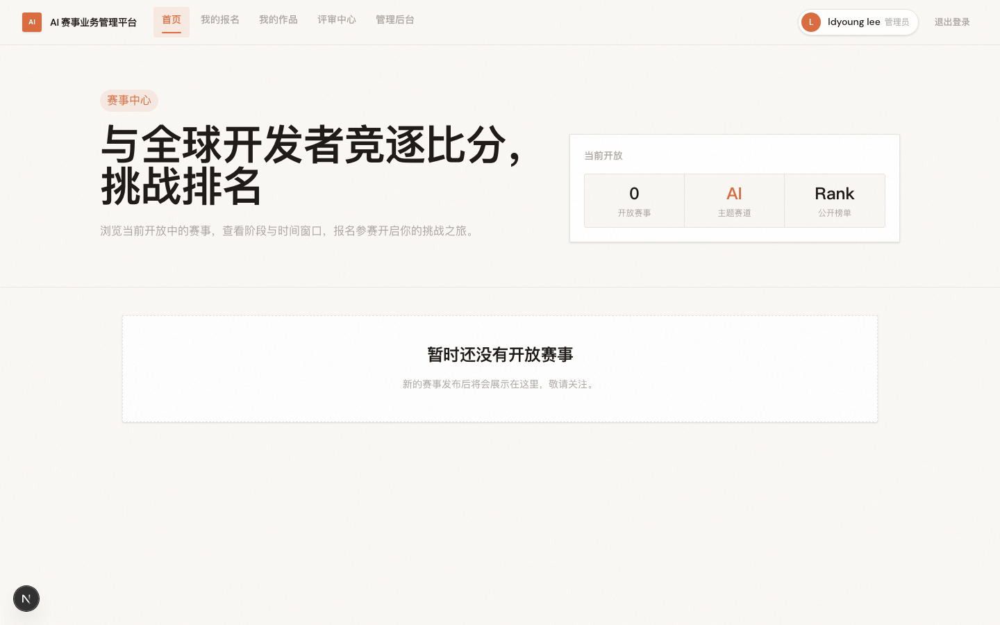
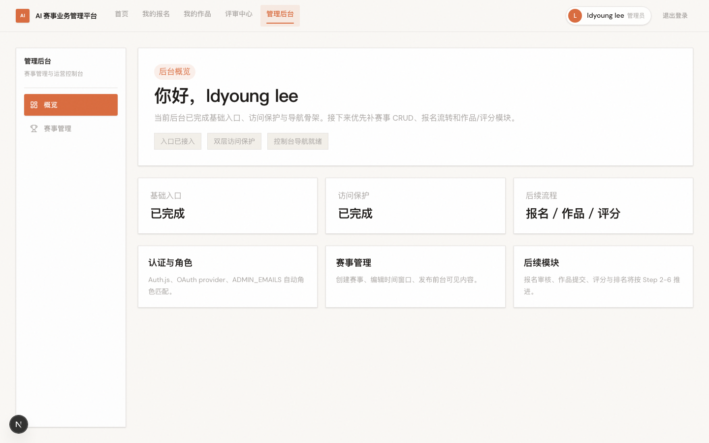
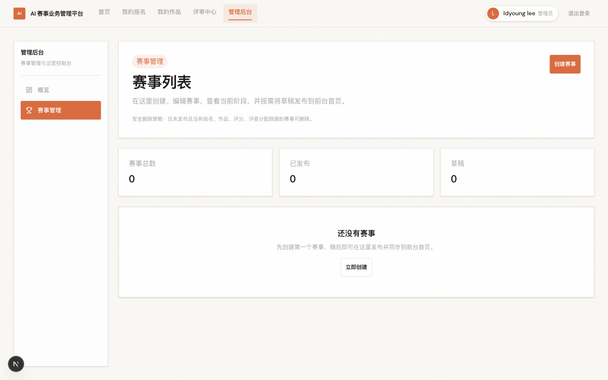
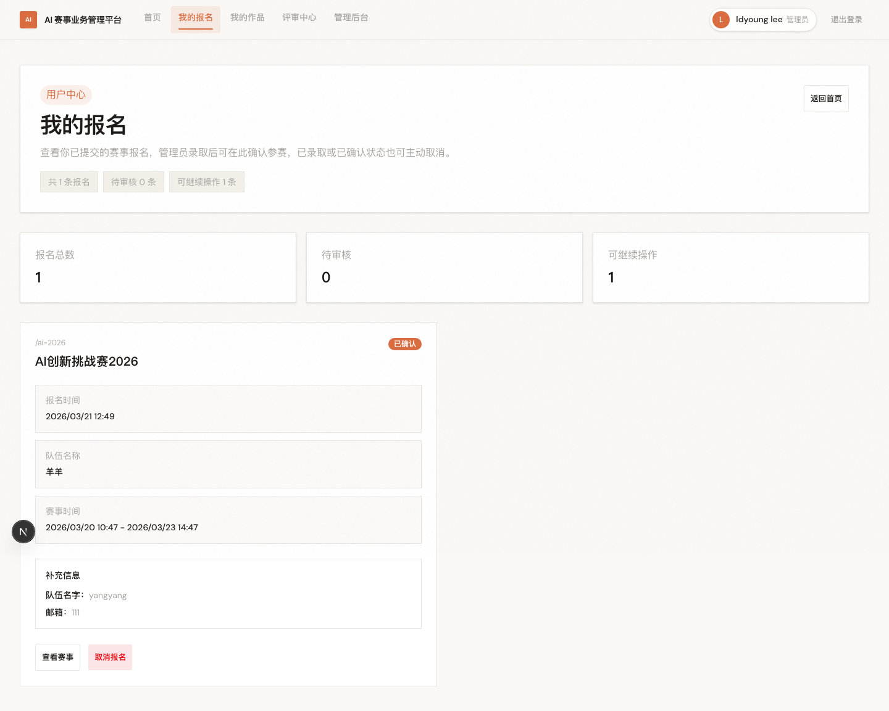
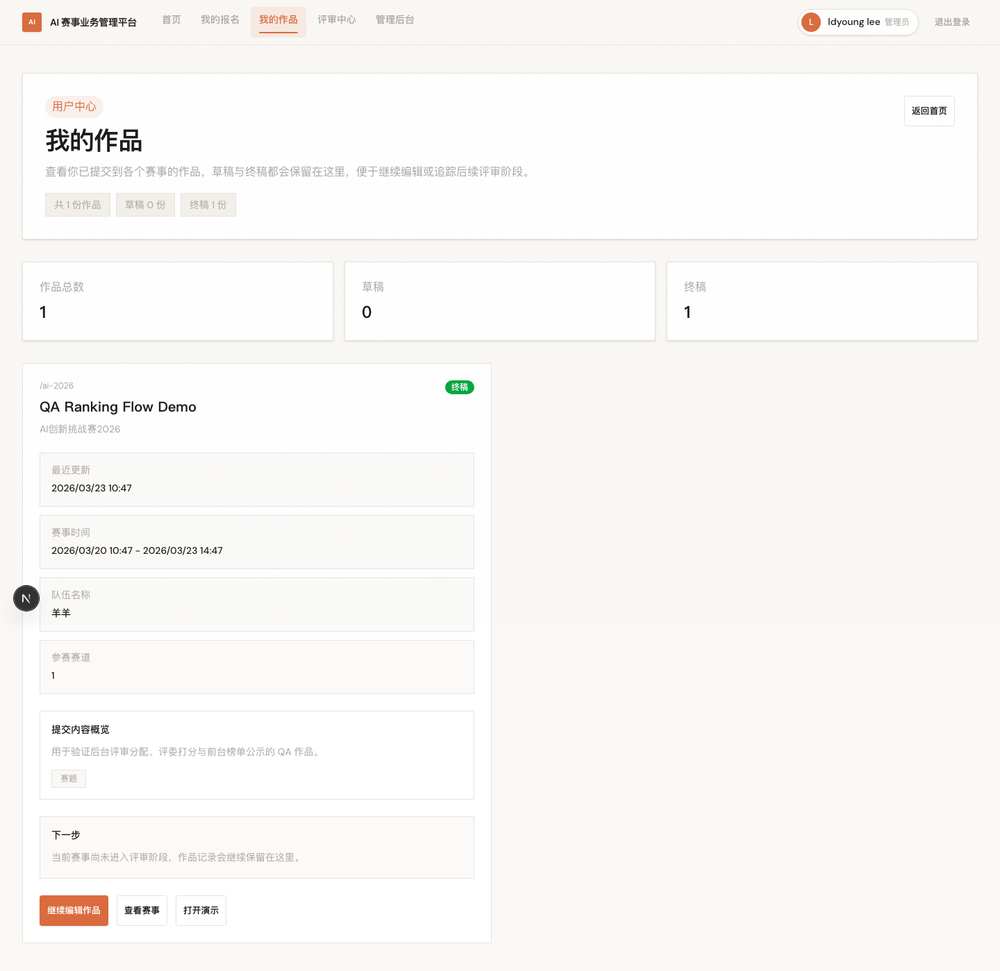
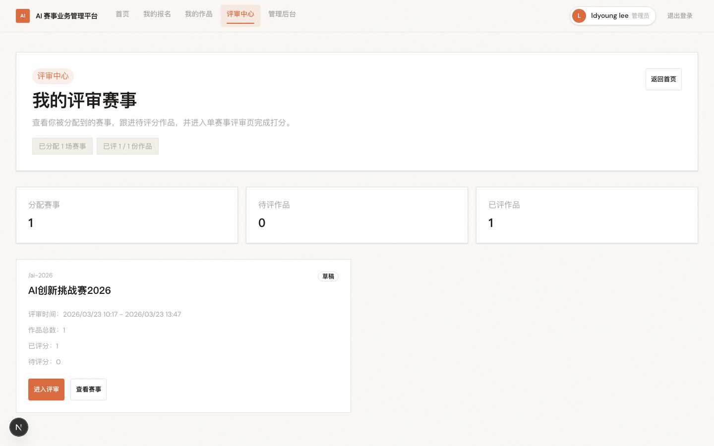

# AI 赛事业务管理平台

AI 赛事管理平台，支撑完整赛事运营流程：**赛事配置 → 报名审核 → 作品提交 → 评委评分 → 排名公示**。

> 🔗 线上地址：**https://sspt-ai.vercel.app/**

## 系统截图

### 首页 — 赛事中心

展示当前开放的赛事列表，支持浏览赛事详情和一键报名。



### 管理后台 — 概览仪表盘

管理员登录后进入后台概览，查看系统状态和功能模块。



### 管理后台 — 赛事管理

创建、编辑、发布赛事，管理报名、作品和评审。



### 我的报名

参赛者查看已提交的报名记录，确认参赛或取消报名。



### 我的作品

参赛者管理已提交的作品，查看草稿/终稿状态和作品详情。



### 评审中心

评委查看被分配的评审赛事，进入评分页面完成打分。



## 技术栈

- **框架：** Next.js 16 (App Router)
- **语言：** TypeScript
- **数据库：** Prisma ORM
- **认证：** Auth.js (Google OAuth)
- **UI：** Tailwind CSS v4 + shadcn/ui
- **测试：** Vitest + Playwright
- **运行时：** Bun
- **部署：** Vercel

## 快速开始

```bash
# 安装依赖
bun install

# 配置环境变量
cp .env.sample .env.local
# 编辑 .env.local 填写 DATABASE_URL、AUTH_SECRET、ADMIN_EMAILS 等

# 数据库迁移
bun run db:migrate

# 启动开发环境
bun run dev
```

打开 [http://localhost:3000](http://localhost:3000) 查看。

> 📖 详细使用说明请查看 [快速操作指南](docs/QUICK_START_GUIDE.md)

## 核心流程

```
管理员创建赛事 → 发布赛事 → 参赛者报名 → 管理员审核
       ↓
参赛者确认参赛 → 提交作品（草稿 → 终稿）
       ↓
管理员分配评委 → 评委评分 → 管理员发布排名 → 前台公示
```

## 项目架构

```
20260317-sspt/
├── src/
│   ├── app/                    # Next.js App Router 页面
│   │   ├── (app)/             # 主应用路由组
│   │   │   ├── admin/         # 管理后台（概览、赛事 CRUD、报名审核、作品管理、评审排名）
│   │   │   ├── events/        # 赛事详情、报名、作品提交
│   │   │   ├── judge/         # 评委评分中心
│   │   │   └── my/            # 用户中心（我的报名、我的作品）
│   │   ├── (landing-pages)/   # 赛事落地页（独立全屏布局）
│   │   └── api/               # API 路由
│   ├── components/            # React 组件
│   │   ├── ui/                # shadcn/ui 基础组件
│   │   ├── events/            # 赛事相关组件
│   │   ├── projects/          # 项目/作品组件
│   │   ├── registrations/     # 报名相关组件
│   │   └── reviews/           # 评审相关组件
│   ├── lib/                   # 工具函数与业务逻辑
│   │   ├── events/            # 赛事 Server Actions
│   │   ├── projects/          # 项目/作品逻辑
│   │   ├── registrations/     # 报名逻辑
│   │   ├── reviews/           # 评审逻辑
│   │   ├── access-control.ts  # 权限控制
│   │   ├── auth-guards.ts     # 认证守卫
│   │   ├── auth-session.ts    # 会话管理
│   │   ├── action-result.ts   # Server Action 返回格式
│   │   └── prisma.ts          # Prisma Client 单例
│   ├── auth.ts                # Auth.js 实例配置
│   ├── auth.config.ts         # Auth.js Provider 配置
│   └── proxy.ts               # 请求代理/中间件
├── prisma/
│   └── schema.prisma          # 数据库模型定义
├── docs/                      # 文档与截图
├── public/                    # 静态资源
└── e2e/                       # E2E 测试
```

### 页面路由总览

| 路径 | 说明 | 权限 |
|------|------|------|
| `/` | 首页 — 赛事列表 | 公开 |
| `/events/[slug]` | 赛事详情 | 公开 |
| `/events/[slug]/register` | 赛事报名 | 需登录 |
| `/events/[slug]/submit` | 作品提交 | 需登录 + 已确认参赛 |
| `/events/[slug]/landing` | 赛事落地页 | 公开（已发布赛事） |
| `/my/registrations` | 我的报名 | 需登录 |
| `/my/projects` | 我的作品 | 需登录 |
| `/judge` | 评审中心 | 需登录 + 评委身份 |
| `/judge/events/[id]` | 单赛事评分 | 需登录 + 评委身份 |
| `/admin` | 后台概览 | 需管理员 |
| `/admin/events` | 赛事管理 | 需管理员 |
| `/admin/events/new` | 创建赛事 | 需管理员 |
| `/admin/events/[id]/edit` | 编辑赛事 | 需管理员 |
| `/admin/events/[id]/registrations` | 报名审核 | 需管理员 |
| `/admin/events/[id]/projects` | 作品管理 | 需管理员 |
| `/admin/events/[id]/judging` | 评审与排名 | 需管理员 |

### 核心模块说明

| 模块 | 说明 |
|------|------|
| **Auth.js** | 认证系统，支持 Google OAuth，管理员角色通过 `ADMIN_EMAILS` 映射 |
| **Prisma** | ORM 层，定义 User、Event、Registration、Project、ProjectScore、EventJudge 等模型 |
| **Server Actions** | 业务逻辑层，处理赛事 CRUD、报名审核、作品提交、评分等操作 |
| **权限控制** | 双层防护：`proxy.ts` 请求拦截 + `auth-guards.ts` 服务端校验 |

## 常用命令

| 命令 | 说明 |
|------|------|
| `bun run dev` | 启动开发服务器 |
| `bun run lint` | 运行 ESLint |
| `bun run typecheck` | 类型检查 |
| `bun run test` | 运行单元测试 |
| `bun run db:migrate` | 创建并应用数据库迁移 |
| `bun run db:push` | 推送 Schema 到数据库 |
| `bun run db:studio` | 打开 Prisma Studio |
| `bun run db:generate` | 生成 Prisma Client |

## 环境变量

| 变量名 | 说明 | 必填 |
|--------|------|------|
| `DATABASE_URL` | 数据库连接字符串 | ✅ |
| `AUTH_SECRET` | Auth.js 加密密钥 | ✅ |
| `ADMIN_EMAILS` | 管理员邮箱列表（逗号分隔） | ✅ |
| `AUTH_GOOGLE_ID` | Google OAuth Client ID | ✅ |
| `AUTH_GOOGLE_SECRET` | Google OAuth Client Secret | ✅ |
| `AUTH_GITHUB_ID` | GitHub OAuth Client ID | 可选 |
| `AUTH_GITHUB_SECRET` | GitHub OAuth Client Secret | 可选 |

## 设计系统

采用 **Warm Minimal（暖调极简主义）** 设计风格：

- **主色调：** 铜橘 `#D97757`，暖米色背景 `#FAF8F5`
- **字体：** Satoshi (Display) + DM Sans (Body) + IBM Plex Mono (UI Labels)
- **布局：** Grid-disciplined 1px 网格分割，零圆角容器 + 分层圆角交互元素
- **纹理：** 全局 grain 噪点纹理叠加，增加质感

详见 [DESIGN.md](DESIGN.md)。
